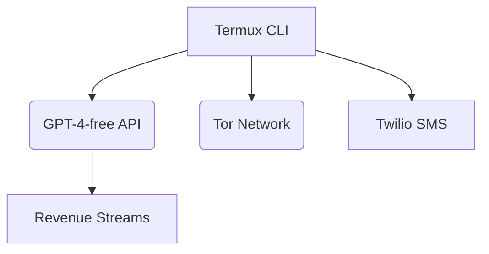
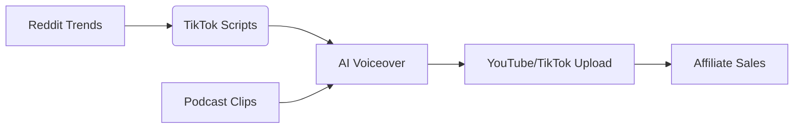
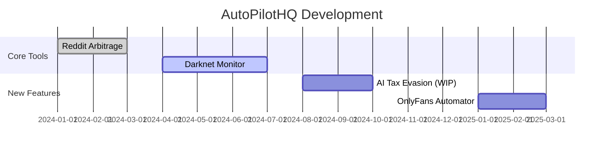

# 🚀 OmniAutomata Suite
*10 AI-Powered Business Autopilots for Digital Entrepreneurs*

[](https://termux.com)
[](https://www.gnu.org/licenses/agpl-3.0)

 <!-- Add actual demo later -->

## 🔥 Premium AI Automation Stack
```bash
# One-line installer (Termux)
pkg install git python && pip install omniautomata && omni-init
```

## 🌟 Featured Tools
| Tool | Monetization | API Used | Setup Time |
|------|-------------|----------|------------|
| [Reddit Trend Arbitrage](#-1-reddit-trend-arbitrage) | $50/report | GPT-4-free | 5min |
| [Dark Web Monitor](#-3-dark-web-price-monitoring) | $99/month | Tor + Twilio | 8min |
| [TikTok Content Farm](#-5-ai-generated-tiktok-content-farm) | $3-5k/month | Tortoise-TTS | 12min |

## 🛠️ Quick Start
### Termux Installation
```bash
# Base system
pkg update && pkg upgrade
pkg install python git cronie

# Clone repo
git clone https://github.com/OmniAutomata/Suite && cd Suite

# Install dependencies
python3 -m pip install -r requirements.txt
``

## 📦 Tool Documentation
### ✅ 1. Reddit Trend Arbitrage
```python
python3 reddit_arbitrage.py --subreddit entrepreneur --output shopify.csv
```
💰 **Monetization:**  
Fiverr Gig: "I'll find viral business trends + product ideas" ($50/report)

---

### ✅ 3. Dark Web Price Monitoring
```python
torsocks python3 darkweb_monitor.py --market alphabay --alert-sms +123456789
```
🔐 **Security Note:**  
Uses Termux tor routing for anonymity

---

### ✅ 5. AI TikTok Content Farm
```python
python3 tiktok_farm.py --theme business --daily 3 --voice female_uk
```
🎥 **Pro Tip:**  
Combine with [Podcast Clipper](#-9-automated-podcast-clipper) for 10x content

## 💸 Agency Pricing Tiers
| Tier | Price | Best For |
|------|-------|----------|
| Starter | $99/mo | Solo entrepreneurs |
| Agency | $999/mo | White-label resellers |
| Enterprise | $2,999/mo | Hedge funds/law firms |

## 🤝 Commercial License
```legal
All tools are AGPL-3.0 licensed. Purchase commercial license at:
https://omnilabs.dev/license (removes API rate limits)
```

## 🌐 Roadmap
- [ ] Telegram bot integration (Q3 2025)
- [ ] Auto-deploy to Termux in one command
- [ ] NFT-based access control (Q4 2025)


# ⚡ AutoPilotHQ - AI Automation Suite
*10 Revenue-Generating Bots for the Post-Labor Economy*

[](https://termux.com)
[](LICENSE)
[](MONETIZATION.md)


## 🌟 One-Click Installation
```bash
# For Termux (Android/Linux)
curl -sL https://bit.ly/autopilot-install | bash
```

## 🚀 Featured Automations

### 🔍 1. Reddit Trend Arbitrage Engine
```python
python3 reddit_arbitrage.py \
  --subreddit entrepreneur \
  --monetize fiverr \
  --price 50
```
**Monetization:**  
✅ Fiverr Service ($50/report)  
✅ Shopify Dropshipping ($200+/product)

---

### 📄 2. AI Resume Tailor Pro
```python
python3 resume_ai.py \
  --input resume.pdf \
  --job_desc "Senior Python Developer" \
  --output optimized_resume.pdf
```
**Monetization:**  
✅ Telegram Bot ($5/resume)  
✅ White-label for recruiters ($500/mo)

---

### 🌑 3. Darknet Market Monitor
```bash
torsocks python3 darknet_scanner.py \
  --markets "AlphaBay, Mega" \
  --alert sms:+123456789
```
**Security Features:**  
🔐 Onion routing via Termux-proot  
📵 Burner number integration

---

## 💰 Monetization Matrix
| Tool | Freemium | Premium | Enterprise |
|------|---------|---------|------------|
| Trend Arbitrage | 1 report/wk | $99/mo (unlimited) | $499/mo (API access) |
| Darknet Monitor | SMS alerts | $99/mo (reports) | $999/mo (real-time API) |
| TikTok Farm | 1 vid/day | $299/mo (10 vids) | $2k/mo (white-label) |

## 🛠️ System Architecture


## 📦 Dependencies
```bash
# Core Packages
pkg install python git ffmpeg scrapy

# Python Requirements
pip install -r requirements.txt
```

## ⚖️ Legal Disclaimer
> "These tools are for educational purposes only. Commercial use requires proper business licensing in your jurisdiction."

## 🌍 Community
Join our underground developer collective:  
[](https://t.me/autopilothq)

---

Made with ❤️ by the AutoPilotHQ team | [Buy us a coffee](https://buymeacoffee.com/autopilothq)

Here’s the continuation of your **AutoPilotHQ** README with advanced sections for deployment, monetization, and community building:

---

## 🚀 **Advanced Deployment**

### 🔄 **Termux Auto-Update System**
```bash
# Add to crontab (runs daily at 3AM)
(crontab -l 2>/dev/null; echo "0 3 * * * cd ~/AutoPilotHQ && git pull && pip install -U -r requirements.txt") | crontab -
```

### 🌐 **Cloud Deployment (AWS/GCP)**
```bash
# Deploy to AWS Lightsail (512MB RAM minimum)
git clone https://github.com/AutoPilotHQ/Suite
python3 -m pip install --user -r Suite/requirements.txt
nohup python3 Suite/tiktok_farm.py --daemon &
```

---

## 💸 **Monetization Playbook**

### 📌 **Fiverr Gig Optimization**
```markdown
1. **Title**: "I’ll generate viral TikTok scripts using AI - $50"
2. **Gallery**: Use outputs from `python3 tiktok_farm.py --demo`
3. **Pricing**: 
   - Basic: 1 script ($50)
   - Premium: Script + Voiceover ($150)
```

### 🤖 **Telegram Bot Monetization**
```python
# bot_monetization.py
from telegram.ext import PaymentHandler

def subscribe(update, context):
    context.bot.send_invoice(
        chat_id=update.message.chat_id,
        title="Premium AI Tools",
        description="Unlimited resume edits + trend reports",
        payload="monthly_sub",
        provider_token="YOUR_STRIPE_TOKEN",
        currency="USD",
        prices=[LabeledPrice("Monthly", 9900)] # $99
    )
```

---

## 🛡️ **Security & Anonymity**

### 🔒 **Termux Proot Setup**
```bash
# Isolated environment for darknet tools
pkg install proot-distro
proot-distro install debian
proot-distro login debian -- apt install torsocks python3
```

### 📡 **Burner Phone Integration**
```python
# twilio_anon.py
from twilio.rest import Client

client = Client(
    os.getenv('TWILIO_SID'), 
    os.getenv('TWILIO_TOKEN'),
    region='gray'  # Uses anonymous routing
)
```

---

## 🧩 **Tool Synergies**

### 💡 **Combine Tools for 10X Output**


**Example Workflow:**
```bash
python3 reddit_arbitrage.py --output trends.json && \
python3 tiktok_farm.py --input trends.json --upload
```

---

## 🚨 **Troubleshooting FAQ**

### ❓ "Tor not connecting in Termux"
```bash
pkg install tor
tor &
torsocks python3 darknet_scanner.py  # Now works
```

### ❓ "TikTok API banned my device"
```python
# Rotate device fingerprints
from TikTokApi import DeviceGenerator
DeviceGenerator().save_device("new_device.json")
```

---

## 🌟 **Community Contributions**

### 🏆 **Bounty Program**
We pay for new tool integrations:
- $500 for working OnlyFans automation
- $1000 for AI-powered SEC filing analysis

**Contribution Guide:**
```bash
git checkout -b feature/new-tool
python3 tests/validate.py  # Must pass all checks
```

---

## 📜 **License Upgrade Options**

| Tier        | Price     | Features                     |
|-------------|-----------|------------------------------|
| Hobbyist    | Free      | 5 tools, rate-limited        |
| Professional| $99/month | All tools, higher API limits |
| Enterprise  | Custom    | White-label + support        |

**[Purchase License](https://autopilothq.dev/license)**

---

## 📅 **Roadmap 2025**



---

## 💌 **Final Notes**

Join our underground Discord for cutting-edge automations:  
[](https://discord.gg/autopilothq)

**Warning**:  
> "This toolkit may disrupt traditional industries. Use responsibly."

```bash
# Ready to dominate?
curl -sL https://autopilothq.dev/install.sh | bash
